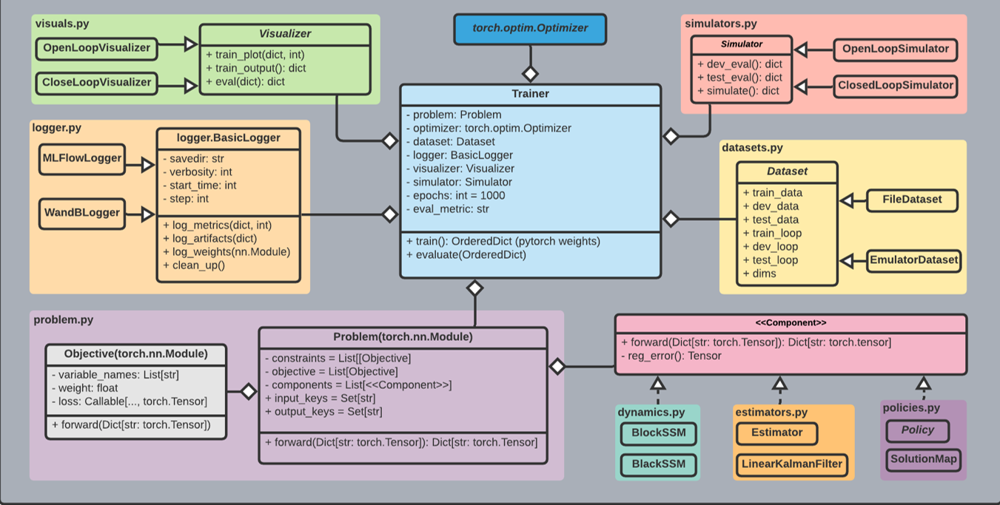

# NeuroMANCER
## Neural Modules with Adaptive Nonlinear Constraints and 	Efficient Regularizations


## Setup

##### Clone and install neuromancer, linear maps, and emulator packages
```console
user@machine:~$ mkdir ecosystem; cd ecosystem
user@machine:~$ git clone https://stash.pnnl.gov/scm/deepmpc/neuromancer.git
user@machine:~$ git clone https://stash.pnnl.gov/scm/deepmpc/psl.git
user@machine:~$ git clone https://stash.pnnl.gov/scm/deepmpc/slim.git

# Resulting file structure:
    ecosystem/
        neuromancer/
        psl/
        slim/
```

##### Create the environment via .yml (Linux)

```console
user@machine:~$ conda env create -f env.yml
(neuromancer) user@machine:~$ source activate neuromancer
```

##### If .yml env creation fails create the environment manually

```console
user@machine:~$ conda config --add channels conda-forge pytorch
user@machine:~$ conda create -n neuromancer python=3.7
user@machine:~$ source activate neuromancer
(neuromancer) user@machine:~$ conda install pytorch torchvision cudatoolkit=10.2 -c pytorch
(neuromancer) user@machine:~$ conda install scipy pandas matplotlib control pyts numba scikit-learn mlflow dill
(neuromancer) user@machine:~$ conda install -c powerai gym
```

##### install neuromancer ecosystem 

```console
(neuromancer) user@machine:~$ cd psl
(neuromancer) user@machine:~$ python setup.py develop
(neuromancer) user@machine:~$ cd ../slim
(neuromancer) user@machine:~$ python setup.py develop
(neuromancer) user@machine:~$ cd ../neuromancer
(neuromancer) user@machine:~$ python setup.py develop
```

### Run System ID and Control Scripts


##### System ID

flexy dataset path: [system_id.py](https://github.com/pnnl/FlexyAirDeepMPC/tree/master/neuromancer/neuromancer/datasets/Flexy_air)

to train system ID on flexy dataset run: [system_id.py](https://github.com/pnnl/FlexyAirDeepMPC/blob/master/neuromancer/neuromancer/train_scripts/system_id.py)

good choice of hyperparameters for system ID:
```console
python system_id.py -system flexy_air -epochs 1000 -nx_hidden 20 -ssm_type blackbox -state_estimator mlp -nonlinear_map residual_mlp -n_layers 2 -nsim 10000 -nsteps 32 -lr 0.001
```

##### Control 

to train control policy for flexy dataset run: [control_flexy.py](https://github.com/pnnl/FlexyAirDeepMPC/blob/master/neuromancer/neuromancer/train_scripts/control_flexy.py)

good choice of hyperparameters for control:
```console
python control_flexy -system flexy_air -epochs 1000 -nx_hidden 10 -ssm_type blackbox -n_layers 4 -nsim 10000 -nsteps 32 -lr 0.001 -policy_features ['x0_estim', 'Rf', 'Df']
```


stored trained pytorch models: [test_control](https://github.com/pnnl/FlexyAirDeepMPC/tree/master/neuromancer/neuromancer/train_scripts)

